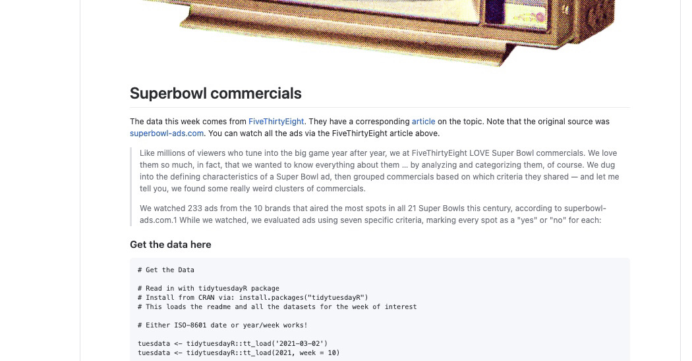

```{r setup, include=FALSE}
knitr::opts_chunk$set(echo = TRUE, message=FALSE, warning=FALSE, fig.width=12, fig.height=6)
library(tidyverse)
library(rlang)
```


The tidyTuesday data for the week of March 4, 2021 represent 247 rows of Superbowl advertisements coded on a few dimensions by `fivethirtyeight`.  The original article uses 233 and there are a few with at least some missing features in the dataset.  The idea was to use binary evaluations of patriotic, funny, uses sex, and a host of other characteristics to describe the universe of Super Bowl ads.  One thing that stands out is the difference between Budweiser and Bud Light.  Here is a brief look at the data that we have.


{width=80%}

The data look like this...

```{r}
youtube <- readr::read_csv('https://raw.githubusercontent.com/rfordatascience/tidytuesday/master/data/2021/2021-03-02/youtube.csv')
head(youtube)
```

A basic visualization

```{r}
library(hrbrthemes); library(magrittr)
# Fix the spelling of Hyundai
youtube %<>% mutate(brand = recode(brand, Hynudai = "Hyundai"))
# Grab the top 75 most likes and plot them
youtube %>% top_n(75, like_count) %>% group_by(brand) %>% summarise(Count = n()) %>% mutate(legendV = paste(brand, sep="-")) %>% ggplot() + aes(x=fct_reorder(legendV, Count), y=Count, fill=legendV) + geom_col() + coord_flip() + labs(x="Brand", title="Top 75 Ads in Likes by brand") + theme_ipsum() + guides(fill=FALSE)
```

Doritos seems to have the most popular commercials followed by Budweiser and Bud Light, Pepsi and Coca-Cola.  Were we to combine Budweiser and Bud Light, they would clearly come out on top.

Now to slice it up a little bit.  There are only ten brands in the dataset of 247 ads.

```{r}
youtube %>% janitor::tabyl(brand) %>% arrange(n)
```
## Sex-Themed Ads?

One category that I did not expect was sex-themed ads.  How often do those occur and what brand chose this form?

```{r}
youtube %>% group_by(brand, use_sex) %>% summarise(Count = n()) %>% ungroup() %>% pivot_wider(names_from=use_sex, values_from = Count) %>% data.frame() %>% mutate(TRUE. = replace_na(TRUE., 0), Total = FALSE. + TRUE., prop = TRUE./Total) -> Brand.Prop
youtube %>% group_by(brand, use_sex) %>% summarise(Count = n()) %>% left_join(., Brand.Prop) %>% ggplot() + aes(x=fct_reorder(brand, prop), y=Count, fill=use_sex) + geom_col() + coord_flip() + scale_fill_ipsum() + theme_ipsum() + labs(fill="Sexually Themed?", title="Super Bowl Ads by Brand and Sex-Themed", x="Brand", caption="Sorted by Proportion of Sex-Themed Ads")
```

I think I like that basic method of visualization.  For this tidyTuesday, I will build it into a function so that I can repeat it for the various characteristics.

## A Function

Now I want to build a basic function that will take the data and whatever variable I wish to fill on and render the data wrangling and plotting automagically.  I will need `rlang` to handle the passing of the variable name along with the companion `!!` method of address and `as_name` to build the caption and title elements.  When I began writing it, I was only going to pull the data together but then I remembered as_name and could complete it; it bears the unfortunate name `DataMaker` for this reason.

```{r}
DataMaker <- function(data, var) {
var <- enquo(var)
data %>% 
  group_by(brand, !! var ) %>% 
  summarise(Count = n()) %>% 
  ungroup() %>% 
  pivot_wider(names_from=!! var, values_from = Count) %>%
  data.frame() %>% 
  mutate(TRUE. = replace_na(TRUE., 0), 
         Total = FALSE. + TRUE., 
         prop = TRUE./Total) %>% 
  select(brand, Total, prop) -> Brand.Prop
data %>% 
  group_by(brand, !! var) %>% 
  summarise(Count = n()) %>% 
  left_join(., Brand.Prop) %>% ggplot() + aes(x=fct_reorder(brand, prop), y=Count, fill=!! var) + geom_col() + coord_flip() + scale_fill_ipsum() + theme_ipsum() + labs(fill=as_name(var), title=paste0("Super Bowl Ads by Brand and ",as_name(var)), caption=paste0("Sorted by Proportion ", as_name(var)), x="Brand")
}
DataMaker(youtube, patriotic)
```

```{r}
DataMaker(youtube, danger)
```


```{r}
DataMaker(youtube, animals)
```

```{r}
DataMaker(youtube, funny)
```

```{r}
DataMaker(youtube, celebrity)
```

