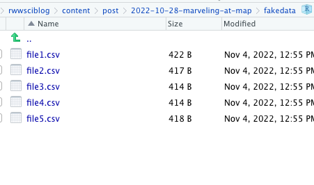

**I want to learn about map and begin to replace my use of apply for everything.** 

```{r setup, include=FALSE}
library(here)
```

Goal: import a directory full of csv files.

Method.  First, load `purrr` and the `tidyverse` and then create a tibble for the *filenames* because we are creating the example.  `map` wants to output a list so I have to unlist it into the tibble.

```{r, warning=FALSE, message=FALSE}
library(tidyverse)
library(purrr)
# Create a set of filenames
fnames <- tibble(
  filenames=unlist(
  map(c(1:5), 
      ~paste0("file",.x,".csv", sep="")
      )))
fnames
```

## Create the files

Now I need to create some files in a given directory.  I have created a directory called *fakedata*.

```
dir.create("fakedata")
```

Now I want to write the data to the directory to conclude the reproducible example.  In this case, there are five csv files.

```
walk(fnames$filenames, 
     ~ write.csv(data.frame(x1=rnorm(10),x2=rnorm(10)),       file = paste0("./fakedata/",.x, sep="")))
```

That seems to work.




## Loading the files

Though I already know the names of the files, in most cases, I would need to collect them.  In this particular case, `dir()` will come in very handy.

```{r}
dir("fakedata")
file.names <- dir("fakedata")
```

Now let's take those and load the files.  We will combine `read.csv` with `map` to get a list containing all of the files.

```{r}
read.files <- file.names %>% map(., ~ read.csv(paste0("fakedata/",.x, sep="")))
read.files
```

Let me stick the filenames on the list elements.  This allows any individual one to be addressed in a relatively intuitive way.  I show an example by calculating the mean of x1 in the third dataset.

```{r}
clean.files <- read.files
names(clean.files) <- file.names
clean.files
clean.files$file3.csv %>% summarise(mean(x1))
mean(read.files[[3]]$x1)
```

If every spreadsheet happened to be the same, as these are, then we could also stack them.  There is a danger to the renaming because of the way it works with unlist.  Sticking with the original file, they are straightforward to stack using `map_dfr()`

```{r}
stacked.files <- file.names %>% map_dfr(., ~ read.csv(paste0("fakedata/",.x, sep="")))
stacked.files
```

